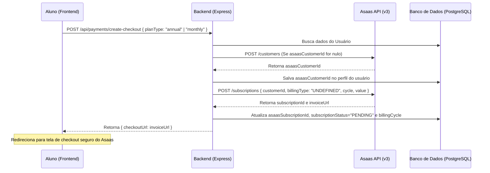

# Documentação Técnica de Serviços, Integrações e Segurança

Este documento detalha o funcionamento, as configurações e as regras de negócio das integrações externas, mecanismos de segurança, agendamento automático e rotas expostas da plataforma **Studr**.

---

## 1. 📧 Integração de E-mail (Resend)

A plataforma utiliza o **Resend** para envio de e-mails transacionais (como códigos de segurança, boas-vindas e recuperação de senha).

*   **Código de Uso:** `server/index.js`
*   **Módulo:** `@prisma/client` + `resend` (SDK Oficial de Node.js)
*   **Variáveis de Ambiente Necessárias:**
    *   `RESEND_API_KEY`: Chave de API secreta obtida no painel do Resend.
    *   `RESEND_FROM_EMAIL`: E-mail oficial remetente homologado no Resend (padrão: `suporte@studr.com.br` / Fallback: `Studr <onboarding@resend.dev>`).

### Fluxos e Templates de E-mail:

1.  **Validação de Conta (Trial de 7 dias):**
    *   *Gatilho:* `POST /api/auth/register` (Cadastro inicial de usuário).
    *   *Conteúdo:* Envia um código numérico aleatório de 6 dígitos (`verificationCode`).
    *   *Assunto:* `Seu código de verificação Studr`
    *   *HTML:* `Olá {nome}, seu código para começar o trial de 7 dias é: <strong>{código}</strong>`

2.  **MFA de Novo Aparelho Detectado:**
    *   *Gatilho:* `POST /api/auth/login` (Se a impressão digital do dispositivo `fingerprint` for nova).
    *   *Conteúdo:* Envia um código de 6 dígitos que expira em 10 minutos para autorizar o novo aparelho.
    *   *Assunto:* `🔒 Novo aparelho detectado - Studr`
    *   *HTML:* Caixa azul estilizada (`#f0f4ff`) contendo o código de segurança e o aviso de expiração de 10 minutos.

3.  **Recuperação de Senha:**
    *   *Gatilho:* `POST /api/auth/forgot-password` (Solicitação de nova senha).
    *   *Conteúdo:* Envia o código temporário para preenchimento no formulário de redefinição.
    *   *Assunto:* `🔑 Recuperação de Senha - Studr`
    *   *HTML:* Código numérico destacado em caixa azul com tempo de expiração de 10 minutos.

4.  **Boas-vindas e Acesso Premium (Venda via Kiwify):**
    *   *Gatilho:* `POST /api/webhooks/kiwify` (Evento de compra aprovada para e-mail sem cadastro anterior).
    *   *Conteúdo:* Criação automática da conta com uma senha temporária aleatória de 8 caracteres alfanuméricos.
    *   *Assunto:* `🚀 Bem-vindo ao Studr! Sua conta no plano {planName}`
    *   *HTML:* E-mail institucional de boas-vindas com e-mail do comprador, senha temporária gerada e link de redirecionamento seguro para `https://app.studr.com.br`.

5.  **Aprovação de Candidatura de Afiliados:**
    *   *Gatilho:* `PUT /api/admin/affiliates/:id/approve` (Aprovação de candidatura).
    *   *Conteúdo:* Envia instruções e links de convite Kiwify para que o usuário se associe aos produtos de afiliação e receba comissões.
    *   *Assunto:* `🎉 Você foi aprovado como afiliado Studr!`
    *   *HTML:* Box institucional contendo links diretos para cada produto de afiliação (`monthlyInvite`, `annualInvite`, `simuladoInvite`) cadastrados no painel administrativo e o link de vendas customizado (`https://studr.com.br?affid={cleanSlug}`).

---

## 2. 🛒 Integração de Pagamento & Webhook (Kiwify)

A Kiwify gerencia as assinaturas e vendas geradas principalmente por tráfego pago e afiliados externos. O backend expõe uma rota dedicada a escutar eventos de status de transações.

*   **Endpoints de Entrada:** `POST /api/webhooks/kiwify` ou `POST /api/webhook/kiwify`
*   **Segurança:** A rota possui um rate limiter específico (`webhookLimiter`) limitando o IP a 120 requisições por minuto. Adicionalmente, verifica um token de segurança enviado na query string (`?token=...`) que deve bater com a chave `KIWIFY_TOKEN` ou `KIWIFY_WEBHOOK_SECRET` do arquivo `.env`.

### Regras de Negócio e Processamento:

*   **Tratamento de Payload:**
    *   O endpoint foi estruturado para aceitar cargas de dados diretas (planas) ou envelopadas em um objeto `{ data: { ... } }` (usado em repasses/split de comissão da Kiwify).
    *   Tratamento robusto de propriedades indiferente a *case-sensitivity* (aceita `Customer` ou `customer`, `product_id` ou `productId`, etc.).

*   **Compra Aprovada (`paid` ou `approved`):**
    *   **Identificação do Plano:** Verifica o ID do plano (`Subscription.plan_id`) ou do produto principal (`product_id`) e consulta a tabela `Plan` no banco.
    *   **Caso o usuário não exista:** Cria automaticamente um registro com o e-mail, nome, status verificado (`isVerified: true`), gera uma senha temporária criptografada com `bcryptjs` e dispara o e-mail de boas-vindas.
    *   **Ativação de Privilégios:** O usuário é atualizado no banco de dados para `isPremium: true`, `subscriptionStatus: 'FULL'` (ou o nível do plano), `planId` mapeado, `lastPaymentDate: new Date()` e o trial anterior é invalidado. Se o plano não estiver pré-cadastrado no banco, o sistema aplica um fallback liberando acesso completo para não travar o cliente pagante.

*   **Reembolso ou Cancelamento (`refunded`, `chargeback`, `canceled`, `cancelled`):**
    *   O backend localiza a conta do usuário pelo e-mail enviado e revoga imediatamente seus acessos: `isPremium: false`, `subscriptionStatus: 'CANCELED'` e `planId: null`.

---

## 3. 💳 Asaas Payment API (Checkout Direto)

O Asaas é integrado como gateway interno para estudantes que assinam diretamente pela tela de planos da aplicação.

*   **Código de Uso:** `server/services/asaasService.js`
*   **Base URL da API:** `https://www.asaas.com/api/v3` (customizável por `ASAAS_API_URL`)
*   **Autenticação:** Cabeçalho HTTP `access_token` contendo o valor da variável de ambiente `ASAAS_API_KEY`.

### Fluxo de Funcionamento:

*   **Valores e Cobranças:**
    *   *Plano Mensal:* Valor de **R$ 59,00** com ciclo de cobrança configurado como `MONTHLY`.
    *   *Plano Anual:* Valor de **R$ 564,00** com ciclo de cobrança configurado como `YEARLY`.
    *   *Vencimento:* Configurado para 24 horas a partir da geração do checkout.

---

## 4. 🛡️ Segurança e Proteção Anti-Bot

A plataforma dispõe de múltiplas camadas de segurança de rede e dados para proteger os endpoints do backend.

### A. Rate Limiting (`express-rate-limit`)
1.  **Rotas de Autenticação (`POST /api/auth/register`, `POST /api/auth/login`):** Limite estrito de **10 tentativas a cada 15 minutos por IP**. Evita ataques de força bruta, estouro de credenciais e inundações automatizadas.
2.  **Webhooks da Kiwify:** Limite de **120 requisições por minuto por IP** para mitigar ataques DDoS que tentem exaurir o servidor se passando pela Kiwify.
3.  **Identificação de Proxy:** Configuração `app.set('trust proxy', 1)` para capturar corretamente o IP real do cliente mesmo atrás do balanceador de carga do Railway.

### B. Proteção Anti-Bot (Cloudflare Turnstile)
*   **Foco:** Rota de registro público `/api/auth/register`.
*   **Funcionamento:** O middleware `validateTurnstile` verifica o token contido no body (`turnstileToken`) ou headers (`x-turnstile-token`, `cf-turnstile-token`).
*   **Validação Assíncrona:** O backend envia uma requisição `POST` com o token e a chave secreta (`TURNSTILE_SECRET_KEY`) para `https://challenges.cloudflare.com/turnstile/v0/siteverify`.
*   **Resultados:** Se o token for inválido, ausente ou expirado, o backend rejeita com status `400 Bad Request` e não consome recursos do banco de dados. Em ambiente de testes ou se a chave não estiver configurada no `.env`, a verificação é bypassada silenciosamente para não travar o desenvolvimento local.

### C. Restrição de Payload
*   **JSON Limit:** O tamanho do corpo JSON recebido em qualquer rota está limitado globalmente a **1MB** (`express.json({ limit: '1mb' })`).
*   **Textos Longos para IA:**
    *   *Redação:* Rota `/api/ai/evaluate-essay` rejeita qualquer texto maior que **10.000 caracteres**.
    *   *Tutor Chat:* Rota `/api/ai/chat` limita o prompt da mensagem para **2.000 caracteres**.
    *   *Objetivo:* Impede ataques de travamento por envio de payloads imensos que paralisam a thread única do Node.js.

### D. Pool de Conexões do Banco de Dados
*   Para evitar exaustão de memória no PostgreSQL, a variável de conexão `DATABASE_URL` inclui parametrizações rígidas:
    *   `connection_limit=10`: Limita o número de conexões ativas simultâneas por instância.
    *   `pool_timeout=15`: Interrompe tentativas de conexões em fila após 15 segundos para evitar estouros de conexões pendentes.

---

## 5. 🕒 Agendamento Automático (Cron Jobs)

O encerramento do ranking e rebaixamento/promoção das ligas de gamificação é feito de forma programada e recorrente.

*   **Biblioteca:** `node-cron`
*   **Configuração de Intervalo:** `5 0 * * 1` (Toda segunda-feira às 00:05 da manhã, fuso horário `America/Sao_Paulo`).
*   **Função Executada:** `rolloverWeek()` do `server/services/rankingService.js`.
*   **Processamento Interno:**
    1.  Calcula a semana atual.
    2.  Registra um instantâneo (`RankingSnapshot`) contendo a liga de cada usuário ativo, XP semanal acumulado e sua colocação final.
    3.  Atualiza as ligas dos usuários baseando-se em suas colocações (promovendo os primeiros colocados e rebaixando os últimos).
    4.  Zera o XP acumulado semanal (`weeklyXp: 0`) de todos os usuários para reiniciar a disputa na segunda-feira.
*   **Script de Contingência:** `server/scripts/rolloverWeek.js` permite acionar o rollover manualmente ou por triggers externos da Railway.

---

## 6. 📈 Monitoramento (Google Analytics / Google Tag Manager)

O monitoramento do comportamento e fluxo de usuários é feito no frontend de forma isolada, respeitando a privacidade dos dados de backend.

*   **Measurement ID / Código da Tag:** `G-TXW30CWTBZ`
*   **Local de Integração:** `client/index.html`
*   **Execução:** Script assíncrono oficial carregado diretamente dos servidores da Google: `https://www.googletagmanager.com/gtag/js?id=G-TXW30CWTBZ`.
*   **Eventos:** Registra eventos básicos de carregamento de páginas (`page_view`) e cliques estruturados que ajudam a medir a conversão da Landing Page para a tela de preços.

---

## 7. 🚫 Prevenção de Abuso (Múltiplos Dispositivos / Compartilhamento de Senha)

A plataforma impede que usuários comprem uma assinatura única e a compartilhem com dezenas de outros estudantes (distribuição pirata de contas).

*   **Banco de Dados:** Tabela `UserDevice` vinculada ao usuário por relação de integridade cascata.
*   **Funcionamento:** No login (`POST /api/auth/login`), o frontend envia uma assinatura única do navegador/dispositivo (`fingerprint`).
*   **MFA Transacional:** 
    *   Se o dispositivo for conhecido e autorizado, o login é efetuado diretamente.
    *   Se for um dispositivo desconhecido, o login é bloqueado temporariamente, gera-se um código OTP de 6 dígitos que é enviado para o e-mail do usuário.
    *   O usuário precisa chamar o endpoint `/api/auth/verify-device` com o código recebido para autorizar e registrar permanentemente aquele dispositivo no banco de dados.

*   **Regra de Abuso (Bloqueio Automático):**
    *   O sistema conta quantos dispositivos foram adicionados/cadastrados para o usuário nos últimos 7 dias.
    *   Se o número de novos aparelhos for **maior ou igual a 5** (`ABUSE_THRESHOLD = 5`), a conta é imediatamente bloqueada:
        *   `isBlocked: true` no banco de dados.
        *   Bloqueia login subsequente retornando o erro: *"Conta bloqueada por atividade suspeita. Entre em contato com o suporte."*
        *   Envia um e-mail de alerta automático via Resend avisando o usuário sobre o bloqueio devido à suspeita de compartilhamento indevido.

---

## 8. 🗺️ Catálogo Geral de Rotas Expostas (Backend API)

Todas as rotas exigem JSON como cabeçalho de comunicação (`Content-Type: application/json`).

### 🔑 Rotas de Autenticação (`/api/auth`)

| Método | Endpoint | Middlewares Aplicados | Função |
|---|---|---|---|
| **POST** | `/api/auth/register` | `authLimiter`, `validateTurnstile` | Registra novo usuário e envia e-mail de código trial |
| **POST** | `/api/auth/register-affiliate` | Nanhum | Cria candidatura para conta de afiliado (status `pending`) |
| **POST** | `/api/auth/verify` | Nenhum | Valida código de cadastro e retorna o token JWT inicial |
| **POST** | `/api/auth/login` | `authLimiter` | Autentica credenciais, valida fingerprint de dispositivo e gera token ou MFA |
| **POST** | `/api/auth/verify-device` | Nenhum | Valida código MFA do novo aparelho e libera token JWT |
| **POST** | `/api/auth/forgot-password` | Nenhum | Solicita código de redefinição de senha por e-mail |
| **POST** | `/api/auth/reset-password` | Nenhum | Efetua a troca da senha usando o código de recuperação |
| **GET** | `/api/auth/me` | `authenticateToken` | Retorna o payload seguro dos dados da sessão do usuário logado |

### 👤 Rotas de Usuário (`/api/users`)

| Método | Endpoint | Middlewares Aplicados | Função |
|---|---|---|---|
| **PUT** | `/api/users/update` | `authenticateToken` | Atualiza o perfil do aluno (protegido contra Mass Assignment) |

### 💳 Rotas de Pagamento e Webhooks (`/api/payments` & `/api/webhooks`)

| Método | Endpoint | Middlewares Aplicados | Função |
|---|---|---|---|
| **POST** | `/api/payments/create-checkout` | `authenticateToken` | Cria assinatura no Asaas e gera URL segura de faturamento |
| **POST** | `/api/webhooks/kiwify` | `webhookLimiter` | Webhook de ativação/cancelamento da Kiwify (suporta plural) |
| **POST** | `/api/webhook/kiwify` | `webhookLimiter` | Webhook de ativação/cancelamento da Kiwify (suporta singular) |

### 🔒 Rotas da Área Premium (`/api/premium`)

| Método | Endpoint | Middlewares Aplicados | Função |
|---|---|---|---|
| **GET** | `/api/premium/features` | `authenticateToken` | Retorna as funcionalidades liberadas (consulta direta na base de dados) |

### 🎓 Rotas de Prática e Simulados (`/api/practice` & `/api/exams`)

| Método | Endpoint | Middlewares Aplicados | Função |
|---|---|---|---|
| **POST** | `/api/practice/start` | `authenticateToken` | Valida cota de uso de questões e registra o início da prática |
| **POST** | `/api/mock/start` | `authenticateToken` | Valida cota de uso de simulados e inicia um novo exame |
| **POST** | `/api/exams/:id/finalize` | `authenticateToken` | Recebe as respostas, calcula a nota final (TRI/Redação) e finaliza |
| **PUT** | `/api/exams/:examId/questions/:orderIndex/answer` | `authenticateToken` | Salva a alternativa marcada para uma questão em tempo real |
| **GET** | `/api/exams` | `authenticateToken` | Lista o histórico de simulados finalizados do estudante |
| **GET** | `/api/exams/:id` | `authenticateToken` | Retorna o detalhamento completo de um simulado e suas questões |

### 🗼 Rotas do Modo Torre Infinita (`/api/tower`)

| Método | Endpoint | Middlewares Aplicados | Função |
|---|---|---|---|
| **GET** | `/api/tower/state` | `authenticateToken` | Retorna o andamento atual do aluno na Torre (prédio, andar, estrelas) |
| **POST** | `/api/tower/submit` | `authenticateToken` | Envia o resultado de um andar da torre (hits do quiz ou nota da redação) |
| **GET** | `/api/tower/top3/:floorNumber` | `authenticateToken` | Retorna os 3 melhores estudantes do andar específico da Torre |

### 🏆 Rotas de Gamificação e Ranking (`/api/gamification` & `/api/ranking`)

| Método | Endpoint | Middlewares Aplicados | Função |
|---|---|---|---|
| **POST** | `/api/gamification/event` | `authenticateToken` | Envia eventos para computação de XP, níveis e liberação de medalhas |
| **GET** | `/api/gamification/state` | `authenticateToken` | Retorna o progresso atual do aluno, XP e lista de medalhas conquistadas |
| **GET** | `/api/ranking` | `authenticateToken` | Retorna a listagem de líderes da liga atual do estudante com paginação |

### 🧠 Rotas de Inteligência Artificial (`/api/ai`)

| Método | Endpoint | Middlewares Aplicados | Função |
|---|---|---|---|
| **POST** | `/api/ai/generate-questions` | `authenticateToken` | Invoca o orquestrador de IA para criar questões ENEM inéditas |
| **POST** | `/api/ai/analyze-sisu` | `authenticateToken` | Analisa a nota inserida contra as notas de corte reais do SiSU |
| **POST** | `/api/ai/study-plan` | `authenticateToken` | Gera recomendações de estudo focadas nos erros cometidos no simulado |
| **POST** | `/api/ai/essay-theme` | `authenticateToken` | Gera temas inéditos e realistas de redação com textos motivadores |
| **POST** | `/api/ai/evaluate-essay` | `authenticateToken` | Efetua a correção automática de redações sob os 5 critérios ENEM |
| **POST** | `/api/ai/chat` | `authenticateToken` | Rota do chat conversacional com o Tutor IA (Llama via Groq) |
| **POST** | `/api/ai/study-map` | `authenticateToken` | Cria um roteiro ou cronograma detalhado de estudos de um tópico |
| **POST** | `/api/ai/grade-1000-example` | `authenticateToken` | Retorna exemplo de redação nota 1000 comentada sobre um tema |

### 📢 Rotas Públicas de Afiliados (`/api/affiliate`)

| Método | Endpoint | Middlewares Aplicados | Função |
|---|---|---|---|
| **GET** | `/api/affiliate/:slug` | Nenhum | Retorna o nome do afiliado e as URLs de checkout com descontos |

### 🛠️ Rotas de Administração (`/api/admin`)

| Método | Endpoint | Middlewares Aplicados | Função |
|---|---|---|---|
| **GET** | `/api/admin/affiliates` | `authenticateToken`, `requireAdmin` | Lista todas as candidaturas e dados das contas de afiliados |
| **PUT** | `/api/admin/affiliates/:id/status` | `authenticateToken`, `requireAdmin` | Atualiza o status de afiliação do usuário |
| **GET** | `/api/admin/affiliate-products` | `authenticateToken`, `requireAdmin` | Lista os produtos e links Kiwify configurados |
| **PUT** | `/api/admin/affiliate-products/:productType` | `authenticateToken`, `requireAdmin` | Salva/Edita o checkout e convite Kiwify de um tipo de produto |
| **PUT** | `/api/admin/affiliates/:id/approve` | `authenticateToken`, `requireAdmin` | Aprova um afiliado, definindo o slug, comissão e enviando e-mail |
| **GET** | `/api/admin/users` | `authenticateToken`, `requireAdmin` | Lista os usuários com dados de tempo de estudo e nível |
| **GET** | `/api/admin/stats` | `authenticateToken`, `requireAdmin` | Retorna métricas globais da plataforma (total de contas, premium, etc.) |
| **PATCH** | `/api/admin/users/:id` | `authenticateToken`, `requireAdmin` | Edita o perfil administrativo do usuário (ex: role, isPremium) |
| **PUT** | `/api/admin/users/:id/toggle-block` | `authenticateToken`, `requireAdmin` | Alterna manualmente o status de bloqueio do usuário (`isBlocked`) |
| **POST** | `/api/admin/users` | `authenticateToken`, `requireAdmin` | Cria um novo usuário diretamente pela interface administrativa |

### 🩺 Rota de Saúde do Sistema (`/api/health`)

| Método | Endpoint | Middlewares Aplicados | Função |
|---|---|---|---|
| **GET** | `/api/health` | Nenhum | Retorna o status de conexão com o banco de dados e modo E2E |

---
*Documentação gerada e atualizada em 22/06/2026.*
